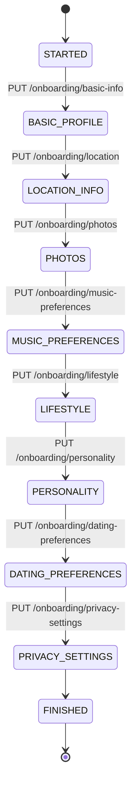

# Dating App Backend - Spring Boot API Status

**Last Updated**: 2025-11-26
**Project**: Music-based Dating Application - Backend API
**Status**: 🟢 Active Development
**Version**: 1.0.0

---

## 📋 Quick Overview

This is the Spring Boot backend API for a music-based dating application that integrates with Spotify to match users based on music preferences, location, and lifestyle compatibility.

### Tech Stack

**Backend (Spring Boot)**:
- Java 17+
- Spring Boot 3.x
- Spring Data JPA
- Spring Security (JWT)
- PostgreSQL Database
- RestTemplate (Spotify API integration)
- Lombok
- Jackson (JSON processing)

**Running at**: `http://localhost:8080`
**API Base**: `/api/v1`

---

## 🎯 Recent Work Completed

### 1. Registration Stage Tracking Fix ✅ (2025-12-01)

**Issue**: `registrationStage` was not being updated during onboarding steps

**Problem**:
- Users remained at `STARTED` stage throughout entire onboarding
- Progress tracking was broken
- Frontend couldn't determine which step user was on
- `nextStep` calculation in progress was incorrect

**Fix Applied**:
- Updated all 8 onboarding methods to set `registrationStage` correctly:
  - `updateBasicProfile()` → sets stage to `BASIC_PROFILE`
  - `updateLocation()` → sets stage to `LOCATION_INFO`
  - `updatePhotos()` → sets stage to `PHOTOS`
  - `updateMusicPreferences()` → sets stage to `MUSIC_PREFERENCES`
  - `updateLifestyle()` → sets stage to `LIFESTYLE`
  - `updatePersonality()` → sets stage to `PERSONALITY`
  - `updateDatingPreferences()` → sets stage to `DATING_PREFERENCES`
  - `updatePrivacySettings()` → sets stage to `FINISHED`

**Impact on Frontend**:
- `GET /api/v1/onboarding/profile` now returns correct `registrationStage`
- `GET /api/v1/onboarding/progress` now shows accurate `currentStage`
- Progress tracking will work correctly
- Users can resume onboarding from correct step

**Modified Files**:
- `OnboardingServiceImpl.java` (lines 50-335) - All 8 update methods

---

### 2. Genres Endpoint Implementation ✅ (2025-11-26)

**Feature**: Pre-selected music genres for onboarding

**Implementation**:
- Added `GET /api/v1/user/genres` endpoint
- Fetches user's top Spotify artists and extracts unique genres
- Returns deduplicated, alphabetically sorted genre list
- Supports optional query parameters: `limit`, `time_range`

**Files Modified**:
1. **SpotifyService.java** - Added `getGenresFromTopArtists()` method signature
2. **SpotifyServiceImpl.java** (lines 195-212) - Implemented genre extraction logic
3. **UserController.java** (lines 135-166) - Added `/genres` GET endpoint

**Bug Fix**:
- Fixed `artistsDto.getArtists()` → `artistsDto.artists()` (Java record accessor)

**Documentation**: `GENRES_ENDPOINT_DOCUMENTATION.md`

---

## 🏗️ Architecture Overview

### Controllers (3)

| Controller | Base Path | Purpose |
|-----------|-----------|---------|
| **AuthController** | `/api/v1/auth` | Spotify OAuth login and user creation |
| **OnboardingController** | `/api/v1/onboarding` | User profile onboarding (8 steps) |
| **UserController** | `/api/v1/user` | Spotify data endpoints (profile, artists, tracks, genres) |

### Services (6)

| Service | Purpose |
|---------|---------|
| **UserService** | User CRUD operations, Spotify token refresh |
| **OnboardingService** | Onboarding flow logic (8 steps) |
| **SpotifyService** | Spotify API integration (artists, tracks, genres) |
| **JwtService** | JWT token generation and validation |
| **EncryptionService** | Encrypt/decrypt Spotify tokens |
| **GeocodingService** | Google Maps geocoding integration |

### Repositories (7)

| Repository | Entity |
|-----------|--------|
| **UserJpaRepository** | User |
| **UserMusicPreferencesRepository** | UserMusicPreferences |
| **UserLifestyleRepository** | UserLifestyle |
| **UserPersonalityRepository** | UserPersonality |
| **UserDatingPreferencesRepository** | UserDatingPreferences |
| **UserPrivacySettingsRepository** | UserPrivacySettings |
| **UserPhotoRepository** | UserPhoto |

---

## 📡 API Endpoints

### Authentication Endpoints

#### POST `/api/v1/auth/spotify-login`
Handles Spotify OAuth login and user creation

**Request Body**: `UserDtoRequest`
```json
{
  "spotifyId": "string",
  "email": "string",
  "displayName": "string",
  "accessToken": "string",
  "refreshToken": "string",
  "expiresIn": 3600
}
```

**Response**: `UserDtoResponse` (200 OK)
```json
{
  "id": "uuid",
  "email": "string",
  "name": "string",
  "spotifyId": "string",
  "registrationStage": "STARTED",
  "jwtToken": "string"
}
```

**Error Responses**:
- `400 BAD REQUEST` - Invalid user data
- `500 INTERNAL_SERVER_ERROR` - Server error

---

### Onboarding Endpoints

All endpoints require `Authorization: Bearer {JWT_TOKEN}` header.

#### PUT `/api/v1/onboarding/basic-info`
Update basic profile information (Step 1)

**Request Body**: `BasicProfileRequestDto`
```json
{
  "name": "string",
  "dateOfBirth": "1995-06-15",
  "gender": "MALE",
  "sexualOrientation": "STRAIGHT"
}
```

**Response**: `UserDtoResponse` (200 OK)

---

#### PUT `/api/v1/onboarding/location`
Update location information (Step 2)

**Request Body**: `LocationDto`
```json
{
  "latitude": 40.7128,
  "longitude": -74.0060,
  "locationCity": "New York",
  "locationCountry": "United States"
}
```

**Response**: `UserDtoResponse` (200 OK)

---

#### PUT `/api/v1/onboarding/photos`
Upload photos (Step 3)

**Request Body**: `PhotosRequestDto`
```json
{
  "photos": [
    {
      "imageUrl": "https://res.cloudinary.com/...",
      "displayOrder": 0,
      "isPrimary": true,
      "caption": "optional caption"
    }
  ]
}
```

**Constraints**:
- Min 1 photo, max 6 photos
- Exactly one photo must have `isPrimary: true`

**Response**: `UserDtoResponse` (200 OK)

---

#### PUT `/api/v1/onboarding/music-preferences`
Update music preferences (Step 4)

**Request Body**: `MusicPreferencesRequestDto`
```json
{
  "favoriteGenres": ["rock", "indie", "pop"],
  "concertFrequency": "FEW_TIMES_A_YEAR",
  "musicImportance": "VERY_IMPORTANT",
  "favoriteDecades": ["2000s", "2010s"],
  "openToNewGenres": true,
  "listeningTimes": ["morning", "evening"],
  "hoursPerDay": 4
}
```

**Response**: `UserDtoResponse` (200 OK)

---

#### PUT `/api/v1/onboarding/lifestyle`
Update lifestyle information (Step 5)

**Request Body**: `LifestyleRequestDto`
```json
{
  "education": "BACHELORS_DEGREE",
  "occupation": "Software Engineer",
  "company": "Tech Corp",
  "relationshipStatus": "SINGLE",
  "wantsKids": "OPEN_TO_KIDS",
  "smokingHabits": "NON_SMOKER",
  "drinkingHabits": "SOCIAL_DRINKER",
  "exerciseFrequency": "FEW_TIMES_A_WEEK",
  "religion": "Agnostic",
  "politicalViews": "Liberal"
}
```

**Response**: `UserDtoResponse` (200 OK)

---

#### PUT `/api/v1/onboarding/personality`
Update personality information (Step 6)

**Request Body**: `PersonalityRequestDto`
```json
{
  "bio": "Music lover and concert enthusiast...",
  "interests": ["concerts", "hiking", "photography"],
  "mbti": "INFP",
  "lookingForText": "Someone who loves live music...",
  "favoriteQuote": "Music is life",
  "conversationStarters": "Ask me about my favorite concert"
}
```

**Constraints**:
- `bio`: Max 500 characters, required
- `lookingForText`: Max 500 characters
- `favoriteQuote`: Max 300 characters
- `conversationStarters`: Max 500 characters

**Response**: `UserDtoResponse` (200 OK)

---

#### PUT `/api/v1/onboarding/dating-preferences`
Update dating preferences (Step 7)

**Request Body**: `DatingPreferencesRequestDto`
```json
{
  "minAge": 25,
  "maxAge": 35,
  "maxDistanceKm": 50,
  "interestedInGenders": ["MALE", "NON_BINARY"],
  "relationshipGoal": "SERIOUS_RELATIONSHIP",
  "dealBreakers": ["smoking"],
  "showMe": "everyone",
  "musicMatchImportance": 80
}
```

**Constraints**:
- `minAge`: Min 18, must be < maxAge
- `maxAge`: Max 100, must be > minAge
- `maxDistanceKm`: Min 1
- `interestedInGenders`: Required, not empty

**Response**: `UserDtoResponse` (200 OK)

---

#### PUT `/api/v1/onboarding/privacy-settings`
Update privacy settings (Step 8)

**Request Body**: `PrivacySettingsRequestDto`
```json
{
  "isProfilePublic": true,
  "showAge": true,
  "showDistance": true,
  "showLastActive": false,
  "discoverable": true,
  "showLikedByYou": false,
  "showSpotifyProfile": true,
  "showMusicStats": true,
  "incognitoMode": false,
  "readReceipts": true
}
```

**Response**: `UserDtoResponse` (200 OK)

---

### Onboarding GET Endpoints

#### GET `/api/v1/onboarding/profile`
Get complete user profile

**Response**: `CompleteProfileResponseDto` (200 OK)
```json
{
  "id": "uuid",
  "email": "user@example.com",
  "name": "John Doe",
  "dateOfBirth": "1995-06-15",
  "age": 29,
  "gender": "MALE",
  "sexualOrientation": "STRAIGHT",
  "registrationStage": "FINISHED",
  "locationCity": "New York",
  "locationCountry": "United States",
  "latitude": 40.7128,
  "longitude": -74.0060,
  "photos": [],
  "primaryPhotoUrl": "https://...",
  "musicPreferences": {},
  "lifestyle": {},
  "personality": {},
  "datingPreferences": {},
  "privacySettings": {},
  "progress": {}
}
```

---

#### GET `/api/v1/onboarding/progress`
Get onboarding progress

**Response**: `OnboardingProgressDto` (200 OK)
```json
{
  "currentStage": "MUSIC_PREFERENCES",
  "completionPercentage": 50,
  "stepsCompleted": {
    "BASIC_PROFILE": true,
    "LOCATION_INFO": true,
    "PHOTOS": true,
    "MUSIC_PREFERENCES": true,
    "LIFESTYLE": false,
    "PERSONALITY": false,
    "DATING_PREFERENCES": false,
    "PRIVACY_SETTINGS": false
  },
  "nextStep": "LIFESTYLE"
}
```

---

#### GET `/api/v1/onboarding/music-preferences`
**Response**: `MusicPreferencesResponseDto` (200 OK)

#### GET `/api/v1/onboarding/lifestyle`
**Response**: `LifestyleResponseDto` (200 OK)

#### GET `/api/v1/onboarding/personality`
**Response**: `PersonalityResponseDto` (200 OK)

#### GET `/api/v1/onboarding/dating-preferences`
**Response**: `DatingPreferencesResponseDto` (200 OK)

#### GET `/api/v1/onboarding/privacy-settings`
**Response**: `PrivacySettingsResponseDto` (200 OK)

#### GET `/api/v1/onboarding/photos`
**Response**: `List<PhotoResponseDto>` (200 OK)

---

### User/Spotify Endpoints

#### GET `/api/v1/user`
Get current user's Spotify profile

**Response**: `SpotifyUserProfile` (200 OK)
```json
{
  "id": "spotify_user_id",
  "displayName": "John Doe",
  "email": "user@example.com",
  "country": "US",
  "followers": 42,
  "imageUrl": "https://..."
}
```

---

#### GET `/api/v1/user/artists`
Get user's top Spotify artists

**Query Parameters**:
- `limit` (optional, default: 20) - Number of artists (max: 50)
- `time_range` (optional, default: "medium_term") - short_term | medium_term | long_term
- `offset` (optional, default: 0) - Pagination offset

**Response**: `SpotifyArtistDto` (200 OK)
```json
{
  "total": 50,
  "artists": [
    {
      "id": "artist_id",
      "name": "Arctic Monkeys",
      "genres": ["indie rock", "rock"],
      "images": [
        {
          "url": "https://...",
          "height": 640,
          "width": 640
        }
      ]
    }
  ]
}
```

---

#### GET `/api/v1/user/tracks`
Get user's top Spotify tracks

**Query Parameters**:
- `limit` (optional, default: 20) - Number of tracks (max: 50)
- `time_range` (optional, default: "medium_term") - short_term | medium_term | long_term
- `offset` (optional, default: 0) - Pagination offset

**Response**: `SpotifyTrackDto` (200 OK)
```json
{
  "total": 50,
  "tracks": [
    {
      "id": "track_id",
      "name": "Do I Wanna Know?",
      "artists": ["Arctic Monkeys"],
      "album": "AM",
      "duration": 272000,
      "popularity": 89
    }
  ]
}
```

---

#### GET `/api/v1/user/genres` 🆕
Get suggested genres from user's top artists

**Query Parameters**:
- `limit` (optional, default: 20) - Number of top artists to analyze
- `time_range` (optional, default: "medium_term") - short_term | medium_term | long_term

**Response**: `List<String>` (200 OK)
```json
[
  "alternative rock",
  "indie pop",
  "indie rock",
  "pop",
  "rock"
]
```

**Documentation**: See `GENRES_ENDPOINT_DOCUMENTATION.md`

---

## 🗂️ Data Models

### Entities (7)

| Entity | Table | Purpose |
|--------|-------|---------|
| **User** | `users` | Core user entity with Spotify integration |
| **UserMusicPreferences** | `user_music_preferences` | Music taste and concert habits |
| **UserLifestyle** | `user_lifestyle` | Education, occupation, habits |
| **UserPersonality** | `user_personality` | Bio, interests, MBTI |
| **UserDatingPreferences** | `user_dating_preferences` | Match criteria and filters |
| **UserPrivacySettings** | `user_privacy_settings` | Visibility and privacy controls |
| **UserPhoto** | `user_photos` | Profile photos with ordering |

### Relationships

```
User (1) ---> (1) UserMusicPreferences
User (1) ---> (1) UserLifestyle
User (1) ---> (1) UserPersonality
User (1) ---> (1) UserDatingPreferences
User (1) ---> (1) UserPrivacySettings
User (1) ---> (*) UserPhoto
```

All relationships use `@OneToOne` or `@OneToMany` with cascade operations.

---

## 🎨 Enums

### Gender
```
MALE, FEMALE, NON_BINARY, OTHER, PREFER_NOT_TO_SAY
```

### SexualOrientation
```
STRAIGHT, GAY, LESBIAN, BISEXUAL, PANSEXUAL, ASEXUAL,
DEMISEXUAL, QUEER, QUESTIONING, OTHER
```

### RegistrationStage
```
STARTED, BASIC_PROFILE, LOCATION_INFO, PHOTOS, MUSIC_PREFERENCES,
LIFESTYLE, PERSONALITY, DATING_PREFERENCES, PRIVACY_SETTINGS, FINISHED
```

### ConcertFrequency
```
NEVER, RARELY, FEW_TIMES_A_YEAR, MONTHLY, WEEKLY, MULTIPLE_TIMES_A_WEEK
```

### MusicImportance
```
NOT_IMPORTANT, SOMEWHAT_IMPORTANT, IMPORTANT, VERY_IMPORTANT, LIFE_IS_MUSIC
```

### EducationLevel
```
HIGH_SCHOOL, SOME_COLLEGE, ASSOCIATES_DEGREE, BACHELORS_DEGREE,
MASTERS_DEGREE, DOCTORATE, TRADE_SCHOOL, PREFER_NOT_TO_SAY
```

### RelationshipStatus
```
SINGLE, DIVORCED, WIDOWED, SEPARATED, PREFER_NOT_TO_SAY
```

### KidsPreference
```
WANTS_KIDS, DOESNT_WANT_KIDS, HAS_KIDS, HAS_KIDS_WANTS_MORE,
HAS_KIDS_DOESNT_WANT_MORE, OPEN_TO_KIDS, NOT_SURE, PREFER_NOT_TO_SAY
```

### SmokingHabits
```
NON_SMOKER, SOCIAL_SMOKER, REGULAR_SMOKER, TRYING_TO_QUIT, PREFER_NOT_TO_SAY
```

### DrinkingHabits
```
NON_DRINKER, SOCIAL_DRINKER, MODERATE_DRINKER, REGULAR_DRINKER, PREFER_NOT_TO_SAY
```

### ExerciseFrequency
```
NEVER, RARELY, ONCE_A_WEEK, FEW_TIMES_A_WEEK, DAILY, MULTIPLE_TIMES_DAILY
```

### RelationshipGoal
```
CASUAL_DATING, SERIOUS_RELATIONSHIP, FRIENDSHIP, SOMETHING_CASUAL,
MARRIAGE, FIGURING_IT_OUT, PREFER_NOT_TO_SAY
```

### MBTI
```
ISFJ, ISFP, ISTJ, ISTP, INFJ, INFP, INTJ, INTP,
ESFJ, ESFP, ESTJ, ESTP, ENFJ, ENFP, ENTJ, ENTP
```

---

## 🔐 Authentication & Security

### JWT Authentication

All endpoints (except `/auth/spotify-login`) require JWT authentication:

```
Authorization: Bearer {JWT_TOKEN}
```

**Flow**:
1. Frontend sends Spotify OAuth tokens to `/auth/spotify-login`
2. Backend creates/finds user and generates JWT
3. Frontend stores JWT and uses it for all subsequent requests
4. Backend validates JWT on every request using `JwtService`

### Spotify Token Management

**Encryption**:
- Spotify access/refresh tokens are encrypted before storage
- `EncryptionService` handles AES encryption/decryption

**Automatic Refresh**:
- `UserService.getValidSpotifyToken()` automatically refreshes expired tokens
- Called in all Spotify-related endpoints

### Token Storage

```java
User.spotifyAccessToken   // Encrypted access token
User.spotifyRefreshToken  // Encrypted refresh token
User.spotifyTokenExpiry   // Expiration timestamp
```

---

## 📁 Project Structure

```
src/main/java/com/example/dating/
├── constants/
│   ├── AppConstants.java           // BASE_API_ROUTE = "/api/v1"
│   └── SpotifyConstants.java       // Spotify API constants
├── controllers/
│   ├── AuthController.java         // POST /auth/spotify-login
│   ├── OnboardingController.java   // PUT/GET /onboarding/*
│   └── UserController.java         // GET /user/*
├── services/
│   ├── UserService.java            // User operations
│   ├── OnboardingService.java      // Onboarding logic
│   ├── SpotifyService.java         // Spotify API integration
│   ├── JwtService.java             // JWT operations
│   ├── EncryptionService.java      // Token encryption
│   └── GeocodingService.java       // Google Maps integration
├── services/impl/
│   ├── UserServiceImpl.java
│   ├── OnboardingServiceImpl.java
│   ├── SpotifyServiceImpl.java
│   ├── JwtServiceImpl.java
│   ├── EncryptionServiceImpl.java
│   └── GeocodingServiceImpl.java
├── repositories/
│   ├── UserJpaRepository.java
│   ├── UserMusicPreferencesRepository.java
│   ├── UserLifestyleRepository.java
│   ├── UserPersonalityRepository.java
│   ├── UserDatingPreferencesRepository.java
│   ├── UserPrivacySettingsRepository.java
│   └── UserPhotoRepository.java
├── models/
│   ├── user/domain/
│   │   └── User.java               // Main user entity
│   ├── user/preferences/dao/
│   │   └── UserMusicPreferences.java
│   ├── user/lifestyle/dao/
│   │   └── UserLifestyle.java
│   ├── user/personality/dao/
│   │   └── UserPersonality.java
│   ├── user/dating/dao/
│   │   └── UserDatingPreferences.java
│   ├── user/privacy/dao/
│   │   └── UserPrivacySettings.java
│   ├── user/photos/dao/
│   │   └── UserPhoto.java
│   ├── onboarding/dto/
│   │   ├── BasicProfileRequestDto.java
│   │   ├── LocationDto.java
│   │   ├── PhotosRequestDto.java
│   │   ├── MusicPreferencesRequestDto.java
│   │   ├── LifestyleRequestDto.java
│   │   ├── PersonalityRequestDto.java
│   │   ├── DatingPreferencesRequestDto.java
│   │   ├── PrivacySettingsRequestDto.java
│   │   ├── CompleteProfileResponseDto.java
│   │   └── OnboardingProgressDto.java
│   ├── user/artists/dto/
│   │   ├── SpotifyArtistDto.java
│   │   └── SimplifiedArtistDto.java
│   └── user/tracks/dto/
│       ├── SpotifyTrackDto.java
│       └── SimplifiedTrackDto.java
├── enums/user/
│   ├── Gender.java
│   ├── SexualOrientation.java
│   ├── RegistrationStage.java
│   ├── ConcertFrequency.java
│   ├── MusicImportance.java
│   ├── EducationLevel.java
│   ├── RelationshipStatus.java
│   ├── KidsPreference.java
│   ├── SmokingHabits.java
│   ├── DrinkingHabits.java
│   ├── ExerciseFrequency.java
│   ├── RelationshipGoal.java
│   └── MBTI.java
├── mappers/
│   ├── OnboardingMapper.java       // Entity <-> DTO mapping
│   └── SpotifyMapper.java          // Spotify DAO <-> DTO mapping
└── exceptions/
    └── UserNotFoundException.java
```

---

## 🔄 Onboarding Flow



Each step:
1. Updates corresponding entity (User, UserMusicPreferences, etc.)
2. Updates `User.registrationStage`
3. Calculates and returns `OnboardingProgressDto`
4. Returns updated `UserDtoResponse`

---

## ⚙️ Configuration

### Environment Variables

```properties
# Database
spring.datasource.url=jdbc:postgresql://localhost:5432/dating_db
spring.datasource.username=postgres
spring.datasource.password=password

# JWT
jwt.secret=your_secret_key_here
jwt.expiration=86400000

# Spotify API
spotify.client.id=your_spotify_client_id
spotify.client.secret=your_spotify_client_secret
spotify.api.base-url=https://api.spotify.com/v1

# Google Maps
google.maps.api.key=your_google_maps_key

# Encryption
encryption.secret.key=your_encryption_key_here

# Server
server.port=8080
```

### CORS Configuration

Configured to allow requests from frontend:
```
http://127.0.0.1:3000
```

---

## 🚀 Running the Backend

### Prerequisites
- Java 17 or higher
- PostgreSQL 14+
- Maven 3.6+

### Build & Run

```bash
# Build
mvn clean install

# Run
mvn spring-boot:run

# Run on specific port
mvn spring-boot:run -Dspring-boot.run.arguments=--server.port=8080
```

### Database Setup

```sql
CREATE DATABASE dating_db;
```

Spring Boot will auto-create tables on first run (using JPA).

---

## ✅ Implementation Status

### Core Features - ✅ Complete

- ✅ Spotify OAuth integration
- ✅ JWT authentication
- ✅ User creation and login
- ✅ Complete 8-step onboarding flow
- ✅ Spotify data integration (artists, tracks, genres)
- ✅ Google Maps geocoding
- ✅ Photo management
- ✅ Token encryption and automatic refresh
- ✅ Progress tracking

### Recent Additions - ✅ Complete

- ✅ Genres endpoint (`GET /api/v1/user/genres`)
- ✅ Spotify token automatic refresh
- ✅ Complete profile retrieval
- ✅ Onboarding progress calculation

### Pending Features - ⏳ Not Started

- ⏳ Matching algorithm
- ⏳ User discovery/swipe functionality
- ⏳ Messaging system
- ⏳ Match management
- ⏳ User profile editing (post-onboarding)
- ⏳ Photo deletion
- ⏳ Account deletion

---

## 🐛 Known Issues & Blockers

### None Currently! 🎉

All known issues have been resolved.

---

## 📝 Important Notes for Frontend Developers

### 1. Authentication Flow

**Initial Login**:
```typescript
// Step 1: User authenticates with Spotify via NextAuth
// Step 2: Send Spotify tokens to backend
const response = await fetch('http://localhost:8080/api/v1/auth/spotify-login', {
  method: 'POST',
  body: JSON.stringify({
    spotifyId: session.user.id,
    email: session.user.email,
    displayName: session.user.name,
    accessToken: session.accessToken,
    refreshToken: session.refreshToken,
    expiresIn: 3600
  })
});

const { jwtToken } = await response.json();
// Store jwtToken for subsequent requests
```

**Subsequent Requests**:
```typescript
fetch('http://localhost:8080/api/v1/onboarding/basic-info', {
  method: 'PUT',
  headers: {
    'Authorization': `Bearer ${jwtToken}`,
    'Content-Type': 'application/json'
  },
  body: JSON.stringify(data)
});
```

### 2. Onboarding Steps

Each step:
- Requires JWT in Authorization header
- Returns updated `UserDtoResponse` with new `registrationStage`
- Can be called multiple times (updates existing data)
- Frontend should track current step and navigate accordingly

### 3. Data Validation

Backend validates:
- Required fields (returns 400 if missing)
- Date formats (ISO 8601: `"YYYY-MM-DD"`)
- Age constraints (18+ for dateOfBirth)
- Enum values (must match exactly)
- Array constraints (non-empty where required)
- String length limits

**Frontend should pre-validate before sending!**

### 4. Error Handling

Standard HTTP status codes:
- `200 OK` - Success
- `400 BAD REQUEST` - Validation error or missing data
- `401 UNAUTHORIZED` - Invalid/missing JWT token
- `404 NOT FOUND` - User not found
- `500 INTERNAL_SERVER_ERROR` - Server error

### 5. Spotify Data

**Time Ranges**:
- `short_term` - Last 4 weeks
- `medium_term` - Last 6 months (recommended default)
- `long_term` - All time

**Limits**:
- Default: 20 items
- Max: 50 items
- Use higher limits for better genre coverage

### 6. Photos

**Important**:
- Photos must be uploaded to Cloudinary FIRST
- Send Cloudinary URLs to backend
- Exactly one photo must have `isPrimary: true`
- `displayOrder` should be 0-indexed

---

## 🔗 Related Documentation

| Document | Purpose |
|----------|---------|
| `BACKEND_PROJECT_STATUS.md` | This file - Complete backend docs |
| `FRONTEND_PROJECT_STATUS.md` | Frontend Next.js status |
| `SYNC_STRATEGY.md` | How to sync backend and frontend Claude agents |
| `GENRES_ENDPOINT_DOCUMENTATION.md` | Genres endpoint integration guide |
| `CLAUDE_SYNC_GUIDE.md` | Multi-agent sync instructions |

---

## 🚀 Next Steps / Roadmap

### Immediate (Testing Phase)

1. **Integration Testing**
   - Test complete onboarding flow with frontend
   - Verify all endpoints return correct data
   - Test error scenarios
   - Validate JWT token refresh

2. **Performance Optimization**
   - Add caching for Spotify data
   - Optimize database queries
   - Add connection pooling

### Short Term (Core Features)

1. **Matching Algorithm**
   - Music taste compatibility scoring
   - Location-based filtering
   - Preference matching logic
   - Deal breaker validation

2. **Discovery Feed**
   - User card generation
   - Swipe logic (like/pass)
   - Match creation
   - Match notifications

3. **Profile Management**
   - Edit profile after onboarding
   - Delete photos
   - Update preferences
   - Account deactivation

### Medium Term (Engagement Features)

1. **Messaging System**
   - WebSocket integration
   - Real-time chat
   - Message history
   - Unread notifications

2. **Enhanced Matching**
   - Music compatibility percentage calculation
   - Shared artists/genres highlighting
   - Concert/event matching
   - Location-based suggestions

---

## 📞 API Quick Reference

### Base URL
```
http://localhost:8080/api/v1
```

### Endpoint Summary

| Method | Endpoint | Auth | Purpose |
|--------|----------|------|---------|
| POST | `/auth/spotify-login` | No | Login/Register user |
| PUT | `/onboarding/basic-info` | Yes | Update basic profile |
| PUT | `/onboarding/location` | Yes | Update location |
| PUT | `/onboarding/photos` | Yes | Upload photos |
| PUT | `/onboarding/music-preferences` | Yes | Update music prefs |
| PUT | `/onboarding/lifestyle` | Yes | Update lifestyle |
| PUT | `/onboarding/personality` | Yes | Update personality |
| PUT | `/onboarding/dating-preferences` | Yes | Update dating prefs |
| PUT | `/onboarding/privacy-settings` | Yes | Update privacy |
| GET | `/onboarding/profile` | Yes | Get complete profile |
| GET | `/onboarding/progress` | Yes | Get onboarding progress |
| GET | `/user` | Yes | Get Spotify profile |
| GET | `/user/artists` | Yes | Get top artists |
| GET | `/user/tracks` | Yes | Get top tracks |
| GET | `/user/genres` | Yes | Get suggested genres |

---

**Last Updated**: 2025-12-01
**Backend Status**: ✅ Ready for Frontend Integration
**Next Review**: Before adding matching algorithm

---

*This document serves as the source of truth for backend status. Update after significant changes.*
